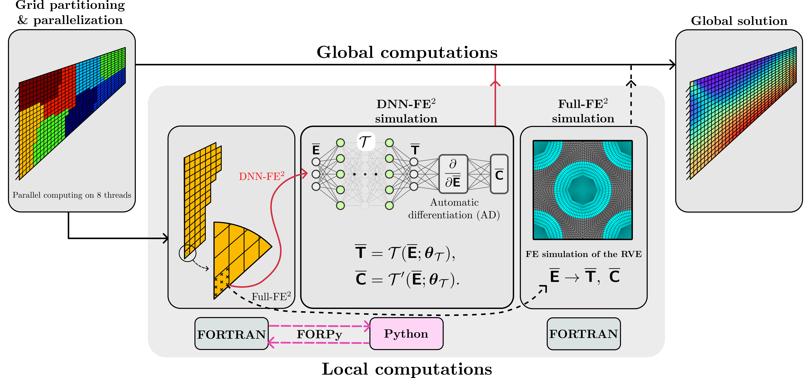

# FE2-Computations-With-Deep-Neural-Networks
FE<sup>2</sup> Computations With Deep Neural Networks: Algorithmic Structure, Data Generation, and Implementation

This repository features codes and data employed for developing deep neural networks (DNN) based surrogate models for FE<sup>2</sup> computations. To gain a significant speed-up of the FE<sup>2</sup> computations, an efficient implementation of the trained neural network in a FORTRAN finite element code is provided using [Forpy](https://github.com/ylikx/forpy). This is achieved by drawing on state-of-the-art high-performance computing libraries, e.g. [JAX](https://github.com/google/jax), and just-in-time (JIT) compilation yielding a maximum speed-up of a factor of more than 5,000 compared to a reference FE<sup>2</sup> computation. More details about the implementation and the results are available in ["FE<sup>2</sup> Computations With Deep Neural Networks: Algorithmic Structure, Data Generation, and Implementation (2023)" H Eivazi, JA Tröger, S Wittek, S Hartmann, A Rausch](http://dx.doi.org/10.2139/ssrn.4485434).



## Citation

```
@article{dnn_fe2,
  author  = {Eivazi, Hamidreza and Tröger, Jendrik-Alexander and Wittek, Stefan and Hartmann, Stefan and Rausch, Andreas},
  title   = {{FE}² Computations With Deep Neural Networks: Algorithmic Structure, Data Generation, and Implementation},
  journal = {SSRN},
  year    = {2023},
  doi     = {http://dx.doi.org/10.2139/ssrn.4485434}
}
```
